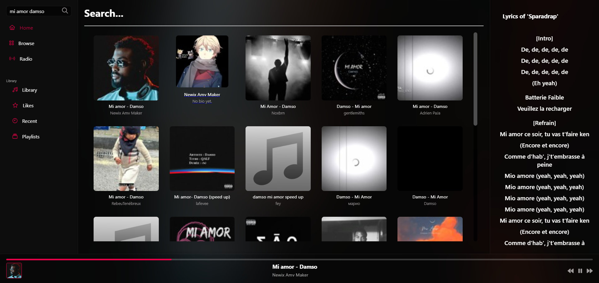
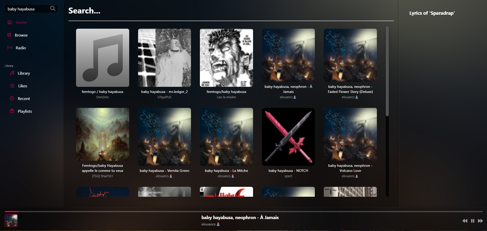
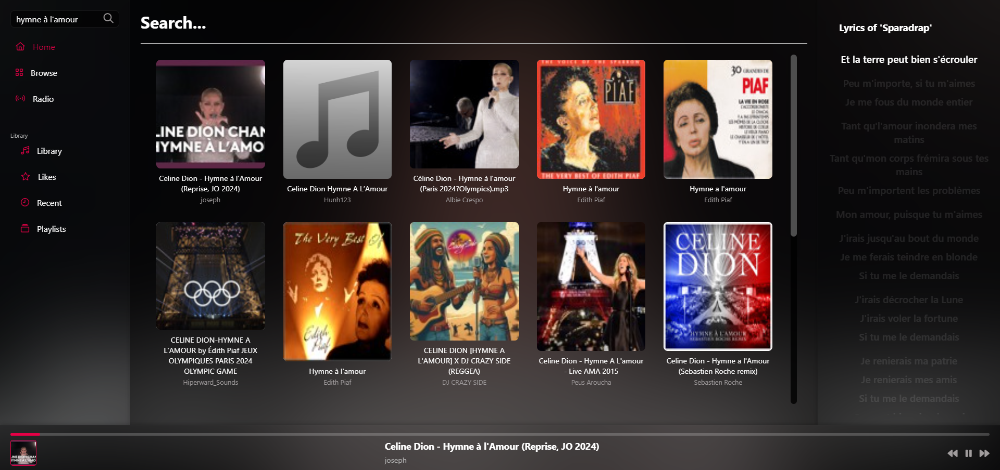

# 🎵 Melodiq

Welcome to **Melodiq**, a brand new music streaming platform designed to offer a smooth and immersive user experience. 🎧 Discover, listen, and explore a vast library of music tailored to your tastes and preferences.

## ✨ Main Features

- 🔍 **Advanced Search**: Instantly find your favorite artists, songs, or playlists with an intuitive search bar.
- 📶 **Seamless Streaming**: Enjoy high-quality music streaming with minimal load times.
- 🎛️ **Simple Controls**: Easily play, pause, rewind, or fast forward your music with accessible controls.
- 📝 **Real-time Lyrics**: Follow along with your favorite songs as the lyrics sync with the music.
- 🎨 **Immersive Design**: Experience a modern, sleek design with dynamic visuals that adapt to the currently playing track.

## 📱 App Preview

### 🏠 First View

### 🎶 Second View

### 🔎 Third View

## 🎯 Usage

- **Search**: Use the search bar to quickly find your favorite tracks.
- **Playback Control**: Manage playback easily using the control buttons.
- **Lyrics**: Song lyrics are displayed during playback for a complete music experience.
